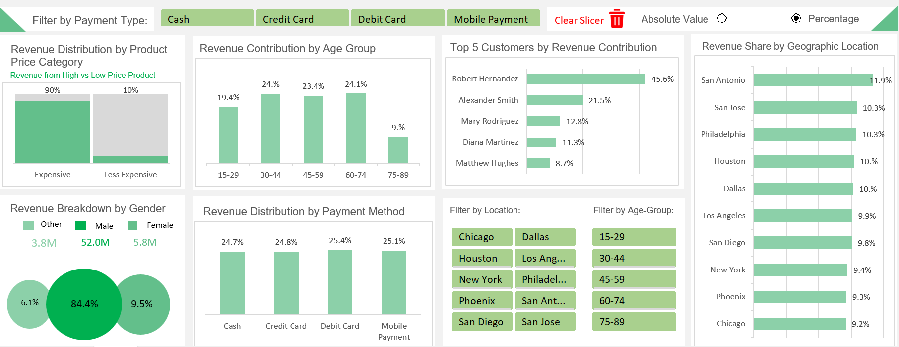

# B&J Biscuit Business Dashboard | Microsoft Excel

An interactive Microsoft Excel dashboard designed to analyse sales performance, profitability, customer segments, products, locations, and salesperson results.

## Project Overview

This project transforms biscuit-sales data into an interactive business dashboard that provides a clear overview of revenue, costs, profitability, customer behaviour, and regional performance.

The dashboard allows users to filter and compare results across multiple business dimensions.

## Business Objective

The objective was to create an accessible reporting solution that helps business users:

- Monitor total revenue and profitability
- Analyse Cost of Goods Sold
- Compare profit margins across business segments
- Identify top-performing products
- Evaluate salesperson performance
- Understand customer purchasing behaviour
- Compare sales across locations and regions
- Explore results using interactive filters

## Dashboard Analysis

The dashboard provides analysis across the following areas:

### Revenue Performance

Revenue can be examined by:

- Product category
- Customer age group
- Gender
- Payment method
- Location

### Profitability

The report supports profitability analysis by:

- Product or brand
- Customer
- Region
- Salesperson
- Business category

### Customer Analysis

The dashboard helps identify:

- Top customers
- Customer purchasing patterns
- Customer segments contributing strongly to revenue
- Differences between demographic groups

### Product and Salesperson Performance

The report highlights:

- Best-performing products
- Products contributing most to revenue and profit
- Top-performing salespeople
- Areas where business resources may be allocated more effectively

### Geographic Performance

Sales and profitability can be compared across different locations and regions.

## Key Performance Indicators

The dashboard includes business KPIs such as:

- Total revenue
- Total Cost of Goods Sold
- Total profit
- Profit margin
- Quantity sold
- Customer performance
- Product performance

## Interactive Features

Users can explore the dashboard through slicers and filters for:

- Location
- Age group
- Gender
- Payment method
- Product category
- Customer segment

## Analytical Process

The project followed these main stages:

1. Reviewed the sales dataset and business requirements
2. Prepared the data for analysis
3. Organised the data into suitable reporting categories
4. Created calculations for revenue, costs, profit, and margins
5. Developed charts and KPI summaries
6. Added interactive slicers and filters
7. Compared customer, product, salesperson, and regional performance
8. Designed the final dashboard layout for clear business reporting

## Key Insights Supported by the Dashboard

The dashboard helps users identify:

- The products generating the highest revenue and profit
- The most valuable customer groups
- Strong and weak geographic markets
- High-performing salespeople
- Payment methods used by different customer segments
- Business areas with stronger or weaker profit margins

> The figures and findings in this project represent the portfolio dataset and are not presented as the financial performance of a real employer or client.

## Tools and Skills Used

- Microsoft Excel
- Data cleaning
- Business-data analysis
- KPI development
- Interactive filters and slicers
- Dashboard design
- Sales analysis
- Profitability analysis
- Customer segmentation
- Data visualisation

## Project Files

- [Download the Excel dashboard](./B%26J%20Biscuit%20Dashboard.xlsm)
- [View the dashboard requirements](./B%26J%20Buscuit%20Dashboard%20Requirements.pdf)
- [View the dashboard screenshot](./image.png)

> Microsoft Excel desktop is recommended for opening the `.xlsm` dashboard and using all interactive functionality.

## Learning Outcomes

Through this project, I strengthened my ability to:

- Translate business requirements into dashboard KPIs
- Analyse sales and profitability data
- Build interactive reports in Microsoft Excel
- Compare customer, product, and regional performance
- Present complex business information clearly
- Convert raw data into decision-support insights

## Author

**Bilal Ahmed Khanzada**

M.Sc. Artificial Intelligence student focused on data analytics, business intelligence, and machine learning.

- [LinkedIn](https://www.linkedin.com/in/bilal-khanzada/)
- [GitHub](https://github.com/bilalahmed199717)
- Email: bilalahmed199717@gmail.com
